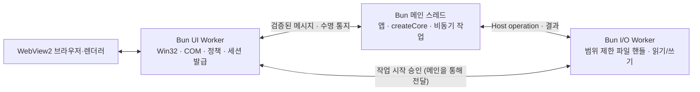

# Windows는 Bun 진입점과 전용 UI Worker로 이식한다

개발 순서는 [ADR 0010](./0010-windows-first-platform-model.md)에 따라 Windows를
먼저 완성한 뒤 다른 플랫폼을 같은 Bun 기반 개발 모델에 맞춘다. 아래 `windowsApp`과
기존 backend 진입점 분리는 당시 구현 기록이며, 공통 앱 정의 하나를 사용하는 방향으로 정리한다.

2026-10-06 Windows 기본 제품 실행을 이 구조로 전환했다. 기존 C++ 호스트·probe·CMake·전용 실행기와 테스트는 삭제했다.
[직접 FFI 실험](../../native/windows/ffi-probe/README.md)에서 같은 Bun 프로세스의
UI Worker가 Win32·WebView2를 소유하고, 메인 스레드의 비동기 작업과 두 창의
개별 수명을 유지함을 확인했다. 기존 코어·정책·Host API·CLI 연결과 실제 다중 창 회귀는
[제품 실행 기록](../architecture/windows-bun-results.md)에 정리했다. 서명·설치·출시 완료와는 구분한다.

Windows 전환 후에는 ADR [0001](./0001-bundled-bun-process.md)의 호스트→Bun 자식
소유권과 [0004](./0004-multi-window-per-view-policy.md)의 프로세스 IPC·Job 종료
규칙을 대체한다. ADR [0002](./0002-host-owned-call-context.md)의 신뢰 경계와
뷰별 정책·프로필·문서 세대는 유지한다. 다른 플랫폼은 이번 범위에 포함하지 않는다.

## 책임과 의존 방향

셋은 같은 프로세스 안의 신뢰 코드다. 프로세스 IPC는 제거하지만 Worker 메시지는
필요하다. WebView 브라우저·렌더러의 별도 프로세스는 유지한다. 앱 백엔드의 직접
Bun API 사용을 차단하는 샌드박스라고 주장하지 않는다.

| 소유자 | 책임 | 소유하지 않는 것 |
| --- | --- | --- |
| 메인 | 패키지 검증·부팅/종료, `createCore`, 앱·플러그인, CoreSession 연결, Host API Promise | HWND·COM 포인터, 웹 출처 판정 |
| UI Worker 하나 | STA, 모든 창·뷰, 하나의 메시지 pump, COM·콜백 수명, 실제 출처·프레임 검증, 컨텍스트 발급·폐기, 작업 권한 승인 | 앱 명령 실행, 블로킹 파일 I/O |
| I/O Worker 하나 | 검증된 작업의 Win32 파일 핸들·읽기/쓰기, 제한된 작업 큐 | COM·창, 임의 컨텍스트의 권한 생성 |

I/O Worker는 기존 C++ 작업 큐의 동기 파일 작업을 이식해 사용한다. Worker 풀·범용 RPC 프레임워크·별도 Rust/C++ 래퍼는 만들지 않는다.

## 배치할 코드

아래 경로에 구현했다. `boot.ts`는 패키지 검증과 앱 import를, `job.ts`는 비정상 종료 자손 회수를 담당한다.

| 경로 | 내용 |
| --- | --- |
| `native/windows/bun/entry.ts` | 검증된 설정과 AppDefinition으로 Worker·코어 연결, 앱 수명 조정 |
| `native/windows/bun/channel.ts` | 내부 메시지 타입·검증·수신 확인·큐 상한·실패 처리 |
| `native/windows/bun/ui.ts` | UI Worker 진입점, 창/뷰 맵, 문서 세대·세션·권한 승인 |
| `native/windows/bun/win32.ts` | DLL 바인딩, Win32 구조체·문자열·HWND와 메시지 pump |
| `native/windows/bun/webview.ts` | COM 인터페이스·vtable·콜백, 환경/controller, 탐색·자원·프레임 이벤트 |
| `native/windows/bun/host-operations.ts` | 파일 I/O Worker 진입점, 작업 시작 승인 후 정책·파일 범위 검사와 실행 |

`packages/core`의 `CoreServices.send`, `callHost`, `openSession`, `stop`을 그대로
사용한다. 이미 있는 경계를 감싸는 새 추상 코어는 만들지 않는다. `protocol`의 Web
메시지·정책·Host operation 스키마와 `client-sdk`도 재사용한다.
`runtime-bun/src/runtime.ts`의 stdin/stdout 경로는 기존 제품용으로 유지한다.
공통 Bun 서비스의 실제 중복이 생길 때만 해당 패키지에서 분리한다.

## 내부 연결 계약

Web 메시지는 기존 JSON 계약과 크기·깊이·방향 검사를 유지한다. Worker 메시지는
구조화 복사를 사용하고 포인터·COM 객체·AbortSignal을 보내지 않는다. `ProcessFrame`의
NDJSON 부트/hello를 그대로 옮기지 않는다. Worker 프로토콜은 Windows 내부 구현이며
공개 Web 프로토콜이나 다른 플랫폼의 프로세스 프로토콜 버전을 변경하지 않는다.
내부 메시지도 방향·타입·실행 식별자와 데이터 크기를 검사한 뒤 복사하며, Web 입력이
제어 메시지로 해석되는 경로를 만들지 않는다.

| 방향 | 메시지와 의미 |
| --- | --- |
| 메인→UI/I/O | 검증된 설정, 초기화, 시작 허가, 종료 요청 |
| UI→메인 | `session-open`, 검증된 `ClientMessage`, `revoke`, 창 종료·렌더러 장애, 정리 완료 |
| 메인→UI | `ServerMessage`, UI Host operation, 실행 승인 요청, 취소 |
| 메인↔I/O | Host operation, 실행 준비·승인, 취소, `HostResponse`, 정리 완료 |

실행 식별자는 `RuntimeIdentity`, 뷰의 전달 식별자는 `{viewId, documentGeneration,
context}`로 고정한다. 요청은 여기에 `requestId`를 붙여 대조한다. UI Worker가
컨텍스트를 새로 발급하며 웹 JSON의 자기 신고값을 사용하지 않는다. 백엔드 자체
컨텍스트는 부트에서 따로 등록하고 뷰 컨텍스트를 백엔드 권한으로 승격하지 않는다.

`postMessage` 성공은 처리 완료가 아니다. 채널별 미확인 데이터 메시지는
`API_LIMITS.maxPending` 이하로 제한하고 수신/폐기 확인 때 슬롯을 반환한다.
웹 요청과 Host API의 개별 취소는 데이터와 분리된 `API_LIMITS.maxPending`개의
미확인 슬롯을 사용한다. 중복·미완료 요청이 아닌 웹 취소는 전달하지 않는다.
모든 뷰의 대기 Web 요청과 미확인 Web 취소의 합도 `API_LIMITS.maxPending` 이하로
제한한다. 새 요청 접수 시 취소 용량을 확보하고, 취소 수신 확인 전에는 재사용하지 않는다.
취소되거나 시간 초과된 `listen`은 늦은 생성 결과를 SDK에 전달해 `unlisten`으로 정리할 때까지 유지한다.
시간 초과는 SDK에 즉시 알리되, SDK는 늦은 결과를 사용자에게 전달하지 않고 구독 정리에만 사용한다.
뷰 폐기(`revoke`/`cancel-context`)는 최대 창 수 128개에 맞춘 별도 미확인 슬롯을 사용한다.
시작·종료에는 별도 제어 슬롯 16개를 유지하며 무제한 우회 큐를 만들지 않는다.
새 요청의 초과는 BUSY, 전달 중인 결과·이벤트나 제어 메시지의 전달 불능은 명시적인
세션/앱 실패로 처리한다. 조용히 누락하거나 같은 요청을 자동 재전송하지 않는다.
수신 확인은 CoreSession의 접수까지이며 장시간 명령 완료를 기다리지 않는다.
진단 로그는 데이터·제어와 분리된 미확인 슬롯 16개를 사용한다. 로그 초과분은
대기열 없이 생략하고 다음 전달 로그의 `droppedDiagnostics`에 개수를 기록한다.
요청 거부를 기록하는 로그가 포화돼 앱 전체를 종료시키지 않도록 한다.

## 신뢰 경계와 경합 처리

UI Worker는 실제 WebView 이벤트의 source와 최상위 프레임을 확인한다. 허용 origin,
현재 문서, 활성 세션, 메시지 방향·크기, 명령·이벤트 정책을 검사한 뒤 코어로 넘긴다.
코어는 기존 입력·출력·권한·취소 검증을 계속 수행한다. 반환 메시지도 WebView에
넣기 직전에 창 생존·문서 세대·활성 컨텍스트를 다시 대조한다.

문서 교체·창 종료·렌더러 장애에서는 UI가 먼저 세대를 올리고 컨텍스트를 폐기한다.
그 뒤 메인에 알리고 CoreSession과 Host API 대기를 취소한다. 알림이 메인에 늦게
도착해도 UI가 이전 세대의 응답과 작업 승인을 거부한다. 같은 문서의 hash/history
변경은 기존 `SourceChanged` 규칙대로 취급한다. 각 뷰의 WebView2 environment와
user-data 경로는 분리하고 새 문서에 기존 세션을 재사용하지 않는다.

I/O는 큐에서 실제 작업을 꺼낸 뒤 UI에 시작 승인을 요청한다. UI는 현재 컨텍스트·
요청 취소 상태·Host operation 정책을 재검사하고 승인 시 해당 작업을 시작 상태로
전환한다. **승인 전 폐기/취소는 작업을 막고, 승인 후 취소는 부작용의 롤백을 보장하지
않는다.** I/O는 승인 뒤 다시 대기 큐에 넣지 않고 실행하며 반환도 현재 세대로 검사한다.
이는 기존 `executeHostOp`의 작업 시작 시점과 취소 의미를 보존한다.
현재 UI Worker의 모달 중에는 새 시작 승인과 UI 결과 전달이 지연될 수 있다.
그동안 메인 백엔드의 타이머·Promise·네트워크는 계속 진행해야 한다.

UI는 창별 루프 대신 스레드당 하나의 bounded PeekMessage/DispatchMessage pump로
Bun에 제어를 돌려준다. COM 콜백의 HRESULT·출력 포인터는 그 STA에서 동기 반환하고,
앱 작업은 콜백 스택을 벗어나 전달한다. Invoke 안의 중첩 pump나 `threadsafe: true`로
동기 COM 반환을 대체하지 않는다. 콜백/vtable/문자열 버퍼의 참조를 유지하며 예외는
HRESULT로 변환한다. 마지막 COM 참조 해제와 콜백 반환을 확인하기 전에 코드를 해제하지 않는다.

파일 범위는 `path.resolve` 검사 후 경로로 다시 여는 방식으로 대체하지 않는다.
기존 `openScopedFile`의 부모 디렉터리 핸들 고정, reparse point·hard link 거부,
최종 핸들 경로 검사, 검사한 핸들을 통한 I/O를 옮긴다. 로그·capabilities도 기존
정책과 지원 정보를 따른다. 탐색·frame 탐색·외부 리소스·새 창·권한 요청은 UI에서
동기적으로 허용/거부하며 COM 콜백 안에서 다른 Worker의 답을 기다리지 않는다.

## 부팅·종료

1. 번들 Bun 버전/revision·manifest·정책·자산·Loader를 검증하고 실행 식별자를 만든다.
   앱 모듈은 자산 검증 뒤 불러온다. 전역 Bun이나 기존 C++ 호스트로 자동 fallback하지 않는다.
   앱 import 전에 데이터 디렉터리의 `host.lock`을 공유 없는 Win32 파일 핸들로 연다.
   같은 데이터 디렉터리의 중복 실행은 거부해 WebView 브라우저와 Job 소유권이 겹치지 않게 한다.
   프로필은 유지하고, 잠금은 프로세스 종료 시 OS가 해제한다.
2. UI/필요한 I/O Worker의 제어 채널과 백엔드 권한 컨텍스트를 먼저 준비한다.
   그 뒤 `createCore`를 호출한다. 플러그인 setup 중의 Host API도 처리할 수 있어야 한다.
3. 코어와 WebView 준비가 모두 끝난 뒤 앱 문서를 탐색하고 SDK hello로 세션을 연다.
   창을 먼저 보여주더라도 준비 전 Web 요청은 거부한다.
4. 개별 창 종료는 그 뷰만 폐기한다. 마지막 창/앱 종료에서는 새 작업을 막고 모든
   세션·요청을 취소한 후 코어·플러그인을 정리한다. pending 승인도 반드시 종료시킨다.
5. UI는 생성 중 완료 콜백까지 처리하고 이벤트 제거→Close→창 파괴→브라우저 종료
   확인→COM/콜백 해제→CoUninitialize 순서로 정리한다. I/O는 시작된 작업과 핸들을
   정리한다. 메시지의 정리 완료와 **각 Worker의 실제 exit**를 모두 확인한다.

UI Worker의 중도 error/exit는 해당 COM 소유 스레드의 상실이므로 앱 전체 실패다.
죽은 Worker의 포인터를 메인에서 해제하거나 그 Worker만 다시 만들어 복구하지 않는다.
WebView renderer 장애는 해당 뷰의 세션 폐기·재탐색, browser 장애는 해당 창 종료로
격리한다. Worker 강제 종료를 정상 정리로 간주하지 않는다.

프로브의 5초는 진단 기준으로 남긴다. 공식 컨트롤에서도 초과했으므로 제품 종료
기한은 자원 정리 보장·실제 종료 확인과 별도로 정한다. 네이티브 호출이 영구 정지한
경우의 정상 정리는 보장하지 않는다. Bun 자신을 앱 import 전에 kill-on-close Job에 배정하여
강제 종료·앱 import 중 생성한 자식·WebView 자손 회수를 실제 검증했다. 정상 WebView 종료는
30초, UI/메인은 35/40초 제한을 적용하고 초과를 실패 처리한다.

## 적용 순서와 완료 조건

| 단계 | 작업 | 통과해야 다음 단계로 이동 |
| --- | --- | --- |
| 1. 코어 연결 | 프로브에서 모듈 분리, 고정 로컬 문서에 실제 SDK·AppDefinition 연결 | 창 안의 invoke/listen/cancel, setup 중 Host API, 부팅 중 종료, 생성 실패 시 부분 자원 정리, 모달 중 백엔드 진행 |
| 2. Web 경계 | 호스트 컨텍스트·문서 세대·탐색/자원 정책과 큐 제한 | 실제 iframe/위조 source 거부, 두 뷰의 같은 요청 ID 분리, 탐색 뒤 응답 폐기, 큐 포화·Worker 장애 |
| 3. Host API | 범위 제한 저장·로그·지원 정보와 I/O Worker | 승인 전/후 취소, 폐기 경합, junction/symlink/hard link·부모 교체 공격, setup/stop 중 정리 |
| 4. 수명 회귀 | 기존 메모 앱과 다중 창 시나리오 | 개별 종료 뒤 나머지 창 동작, renderer 장애 격리, 모든 창·COM·브라우저·Worker 정리 |
| 5. 제품 진입점 | CLI 번들·검증·배포와 실행 문서 전환 | 외부 artifact 설치·프로젝트 이동·독립 빌드, 절대 경로 번들 Bun 실행, 환경 오염 거부, 배포 기동 검증 |

첫 연결은 `examples/memo/src-bunaway/app.ts`처럼 부작용 없는 AppDefinition 모듈을 사용한다.
기존 `backend.ts`/`backend.js`는 import하면 `runBunApp()`가 stdin을 기다리므로
새 호스트의 앱 정의로 import하지 않는다. 제품의 새 bootstrap은 검증 후 앱 정의를
불러오는 진입점으로 번들해야 한다. CLI·템플릿에 `windowsApp` 설정과 default export AppDefinition을 적용했다.
기존 backend 진입점을 암묵적으로 새 모드로 해석하지 않는다.

한 exe 배포·콘솔 없는 시작은 아직 검증하지 않았다. Bun compile을 채택한다면 고정
버전에서 Worker 경로·FFI DLL 동봉·manifest·기동 환경을 먼저 검증해야 한다. 런타임이
자기 해시를 확인하는 것만으로 실행 전 바이너리 검증을 대체했다고 주장하지 않는다.
C++ 없는 독립 프로젝트 빌드·앱 기동은 검증했다. 설치/서명 완료를 의미하지 않는다.

기존 `tests/core`, `tests/api`, `tests/protocol`은 재사용한다. 실제 호스트 검증은
`tests/lifecycle/windows-host.ts`의 기대값을 유지하고 실행기/프로세스 구조 확인만
새 모델에 맞춘다. 기존 네이티브 경계 검사의 취소·폐기·EOF·응답 크기·deadline·프로필
사례는 Bun 회귀로 옮겼으며 C++ 전용 실행기는 삭제했다.
`runtime-bun.test.ts`의 setup·취소·revoke·shutdown 사례는 Worker 연결에
대응시킨다. Windows 링크 생성 권한 부재는 누락 검증으로 기록하며 통과로 바꾸지 않는다.

ADR 0001/0004의 Windows 적용 범위, PRD, 플랫폼 지원 표와 실행 문서를 갱신하고 기본 실행을 전환했다.
기존 호스트를 자동 대안으로 실행하지 않는다. 새 GUI 회귀의 기존 거부 기대값은 유지했다.

구현 기준: [코어 계약](../../packages/core/src/index.ts), [기존 런타임](../../packages/runtime-bun/src/runtime.ts),
[Windows 호스트](../../native/windows/bun/entry.ts), [CLI 번들](../../packages/cli/src/assets.ts),
[CLI 배포](../../packages/cli/src/build.ts), [기존 Windows 회귀](../../tests/lifecycle/windows-host.ts).
